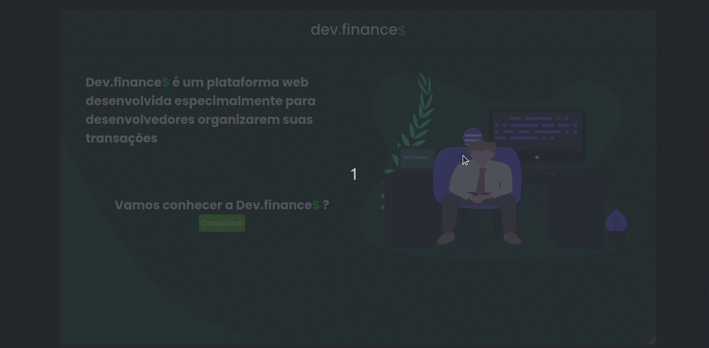

 <h1>Dev.Finance💲 </h1>
 

## Image

---

 
<a href='#about'>About</a> |
<a href='#tecnology'>Tecnology</a> |
<a href='#functionalities'>Functionalities</a> 

 
 

---

 
 

### 
📑 About

This project aims to help you organize your transections! 😄
 
 

### 
🖥 Tecnology

1. HTML
2. CSS
3. JavaScript

### 
 Functionalities

Functionalities   |------
--------- | ------
Create and add | create and add a new transaction
 Delete | delete a transaction
 
 
 
